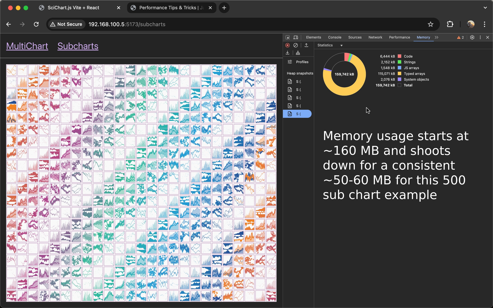
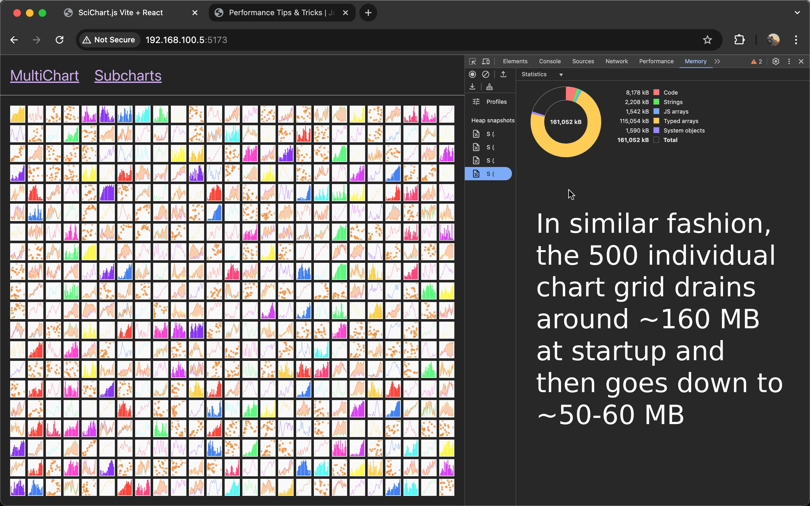

# Stress testing the amount of charts that can be rendered in a single page

## To run this project:
> 1. Clone this repository  

> 2. Run `npm install`  

> 3. Run `npm run dev`  

## 1. By having 500 sub-charts in master chart (found at localhost:5173/subcharts)

## 2. By having 500 individual charts (found at localhost:5173/multichart)

> The exact heap allocation values may differ based on the system configuration and browser used, but not by a very significant amount.

> ! Each of the 500 charts has 500 or 1000 - (if the series is a Band) plot points, while keeping the performance and load speed sub-second.